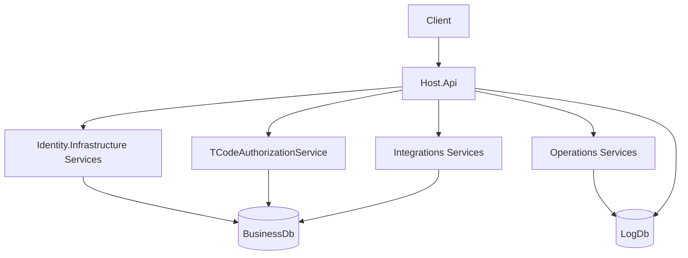
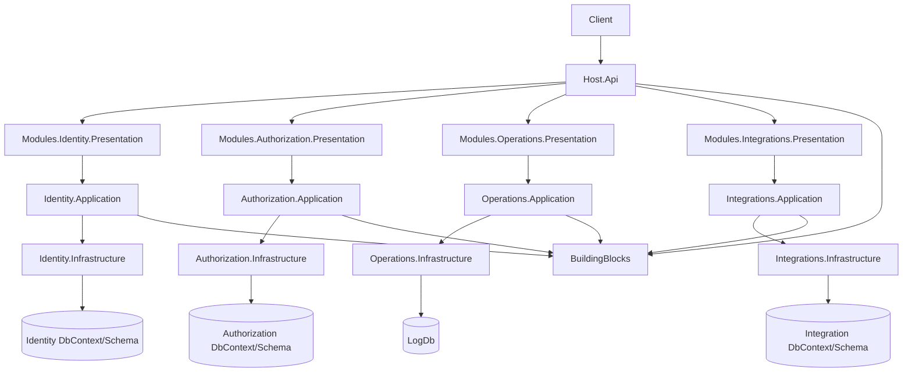
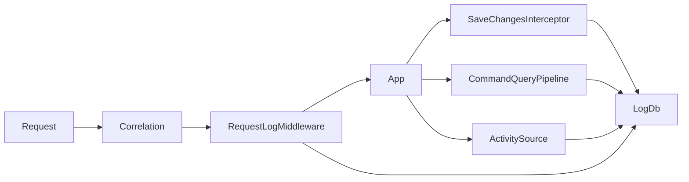

# EnterpriseSystem Current State ve Target State Rehberi

Bu doküman iki şeyi aynı anda yapar:

1. Bugünkü kodun gerçekten ne durumda olduğunu anlatır.
2. Bundan sonra hangi mimari kurallarla ilerleyeceğimizi sabitler.

Bu rehberde Vertical Slice yaklaşımı kaldırılmış kabul edilir.
Yeni yön:

- Basit CRUD: service-based application services
- Karmaşık işlemler: CQRS command/query handlers
- Host.Api: sadece host
- İş kuralları: ilgili modüller
- Cross-cutting: BuildingBlocks
- Standart loglama: bir kere yaz, her yerde kullan
- Localization: TR / EN / DE ortak altyapı

## Bu Turda Uygulananlar

- `Authorization` modulu fiziksel olarak `Application / Infrastructure / Presentation` olarak ayrildi.
- `TCodeController` ve `PermissionsController` host altindan cikarilip `Authorization.Presentation` altina tasindi.
- `AuthController`, `UsersController`, `RolesController`, `SessionsController`, `PasswordPolicyController` host altindan cikarilip `Identity.Presentation` altina tasindi.
- `ICurrentUserContext` ve `SecurityClaimTypes` host disina alinip `Application.Security` altina tasindi.
- Hassas veri redaction, localization kaynak dosyalari ve secret fail-fast altyapisi eklendi.

---

## 1. Karar Özeti

### 1.1 Ne kaldırılıyor

- Vertical Slice
- Host içinde dağınık iş servisleri
- Her yeni senaryoda elle "şunu da logla" yaklaşımı
- Modül sınırını bozan namespace ve klasör karışıklıkları

### 1.2 Ne geliyor

- Service + CQRS hibrit yapı
- Modül bazlı application / infrastructure / presentation ayrımı
- Merkezi log pipeline + redaction + audit + telemetry
- Kaynak dosya tabanlı localization
- Current state ve target state ayrılmış canlı dokümantasyon

---

## 2. Mevcut Durum

Bugünkü çözümün ana akışı:



Sorun:

- `Host.Api` host olmanın ötesine geçmiş durumda.
- Modül presentation katmanı boş, controller'lar host altında.
- Identity ile Authorization domain'leri iç içe.
- Log sistemi güçlü ama standartlaştırılmamış; bazı loglar merkezi, bazıları manuel.

---

## 3. Hedef Durum

Hedef yapı:



Kurallar:

- `Host.Api` sadece startup, middleware, auth host config ve controller discovery için var.
- Controller ilgili modülün `Presentation` katmanında olur.
- Application katmanı HTTP bilmez.
- Infrastructure katmanı iş kuralı tanımlamaz, uygular.
- Her modül kendi verisini ve kontratını sahiplenir.

---

## 4. Neden Vertical Slice kaldırıldı

Bu projede ana yük:

- CRUD ekranları
- Yetki yönetimi
- Oturum yönetimi
- Log/audit operasyonları
- Localization

Bu tür projelerde her endpoint için ayrı slice klasörleri ilk etapta temiz görünür ama zamanla şunları üretir:

- Çok fazla küçük dosya
- Benzer CRUD mantığının tekrar etmesi
- Yeni gelen kişinin sistemi okuma hızının düşmesi
- Transaction, validation, logging, authorization davranışlarının yatay yönetiminin zorlaşması

Bu yüzden karar:

- CRUD için service tabanlı akış
- İş kuralı ve davranışı ağırlaştığında CQRS handler

Yani:

- `CreateUser`, `UpdateUser`, `DeleteUser` gibi işlemler `UserAppService`
- Karmaşık "kullanıcı aç + default yetkiler + notification + session invalidation" gibi işlemler ayrı command handler olabilir

---

## 5. Service + CQRS Birlikte Nasıl Kullanılacak

### 5.1 CRUD akışı

```text
Controller
  -> Application Service
    -> Repository/DbContext
      -> SaveChanges
```

Kullanım alanı:

- sade listeleme
- create/update/delete
- basit filtreleme
- küçük doğrulama kuralları

### 5.2 CQRS akışı

```text
Controller
  -> Command / Query Handler
    -> Domain/Application rules
    -> Multiple services / transaction / external integration
```

Kullanım alanı:

- çok adımlı işlemler
- birden fazla aggregate/tablo etkileyen akışlar
- audit ve security etkisi yüksek işlemler
- rapor / projection / read model

### 5.3 Ayırım kuralı

- Tek tablo, az kural, CRUD ağırlıklıysa: service
- Çok adım, çok bağımlılık, transaction veya orchestration varsa: CQRS

---

## 6. Host.Api Bundan Sonra Ne Yapacak

Host.Api aşağıdakiler dışında iş kuralı taşımaz:

- `Program.cs`
- global middleware
- authentication host configuration
- authorization registration
- exception mapping
- module registration

Host içinde bulunmaması gerekenler:

- `TCodeAuthorizationService`
- `ExternalOutboxService`
- `AuditDashboardService`
- `JwtAccessTokenService`
- modül controller'ları

Taşınacak hedefler:

- `Host.Api/Authorization/*` -> `Modules/Authorization/*`
- `Host.Api/Operations/*` -> `Modules/Operations/*`
- `Host.Api/Integrations/*` -> `Modules/Integrations/*`
- identity controller'ları -> `Modules/Identity/Identity.Presentation`

---

## 7. Identity ve Authorization Neden Ayrılmalı

Bugünkü sorun:

- Identity kullanıcıyı, oturumu, refresh token'ı yönetiyor.
- Authorization ise modül, sayfa, action, condition yetkisini yönetiyor.
- Ama bazı yetki atamaları kullanıcı yaratılırken Identity içinde yapılıyor.

Bu coupling şunu bozar:

- Identity modülü büyürken yetki domain'ini de sahiplenir.
- Authorization bağımsız evrilemez.

Doğru ayrım:

- Identity:
  - User
  - Role
  - Session
  - RefreshToken
  - PasswordHistory
  - Login / Refresh / ChangePassword

- Authorization:
  - Module
  - SubModule
  - Page
  - T-Code
  - CompanyScope
  - ActionPermission
  - ConditionPermission
  - T-Code evaluation

Kullanıcı yaratma sırasında default authorization gerekiyorsa çözüm:

- Identity application service event/command üretir
- Authorization application handler default yetki setini uygular

Bu sayede "kullanıcı açılırken yetki ver" olur ama ownership karışmaz.

---

## 8. BusinessDbContext Nasıl Ayrılmalı

Bugün:

- tek context içinde identity + authorization + integration outbox var

Kısa vadeli çözüm:

- Aynı veritabanında ayrı schema ve ayrı context
- `IdentityDbContext`
- `AuthorizationDbContext`
- `IntegrationDbContext`
- `LogDbContext`

Orta vadeli çözüm:

- Her modül kendi EF mapping ve migration setine sahip olur

Önerilen ilk ayrım:

```text
BusinessDb
  schemas:
    identity
    authorization
    integration

LogDb
  schema:
    logs
```

Faydası:

- migration yönetimi sadeleşir
- modül sınırları görünür olur
- test kurulumları kolaylaşır
- ileride fiziksel ayrıştırmaya hazırlanılır

---

## 9. Standart Log Sistemi Nasıl Kurulacak

Hedef: "şunu da logla" diyerek her serviste elle kod yazmamak.

### 9.1 Log katmanları

1. Request log
2. Security log
3. Audit/entity change log
4. Integration/outbox log
5. Performance/telemetry log

### 9.2 Kural

Log üretimi kodun içine dağılmaz. Pipeline ve interceptor tabanlı olur.

Önerilen yapı:



### 9.3 Hangi teknoloji ne işe yarar

- Middleware: HTTP seviyesini loglar
- EF `SaveChangesInterceptor`: entity diff ve audit log üretir
- EF `DbCommandInterceptor`: SQL seviyesini loglar
- Command/Query pipeline behavior: use-case başlangıç/bitiş, hata, süre
- `ActivitySource`: performans ve distributed tracing bilgisi üretir

### 9.4 Az kod çok iş prensibi

Bir use-case yazarken geliştirici şunları elle yazmamalı:

- correlation id taşıma
- request/response loglama
- duration ölçme
- exception loglama
- entity diff loglama
- SQL loglama

Geliştirici yalnızca iş kuralını yazar.

### 9.5 Hassas veri redaction

Artık sisteme eklenen yeni yaklaşım:

- header redaction
- JSON body alan redaction
- endpoint bazlı body opt-out

Varsayılan maskelenen alanlar:

- `Authorization`
- `Cookie`
- `Set-Cookie`
- `password`
- `currentPassword`
- `newPassword`
- `refreshToken`
- `accessToken`
- `token`
- `secret`

Bu neden önemli:

- Denetimlerde log saklamak gerekir
- Ama kişisel veri ve credential sızıntısı kabul edilemez

Yani hedef:

- Log tut
- Ama sır saklama sınırını aşma

### 9.6 Entity diff log nasıl çalışmalı

Önerilen akış:

1. `SaveChangesInterceptor` change tracker'ı okur
2. `Added/Modified/Deleted` entity'leri yakalar
3. Önceki ve yeni değerleri karşılaştırır
4. Değişen property listesini üretir
5. `EntityChangeLog` tablosuna yazar

Log örneği:

```json
{
  "entityType": "User",
  "entityId": "15",
  "action": "Modified",
  "changedProperties": [
    {
      "name": "Email",
      "old": "old@company.com",
      "new": "new@company.com"
    },
    {
      "name": "IsActive",
      "old": true,
      "new": false
    }
  ]
}
```

### 9.7 Performance telemetry nasıl çalışmalı

`ActivitySource` ile:

- operation name
- start/end time
- duration
- tags
- status

üretilebilir.

Örnek:

- `identity.login`
- `authorization.tcode.evaluate`
- `outbox.dispatch.mail`

Sonra bu activity bilgileri `PerformanceLog` tablosuna dönüştürülebilir.

---

## 10. Fail-Fast Secret Mantığı Nasıl Çalışır

Amaç:

- Uygulama placeholder secret ile yanlışlıkla ayağa kalkmasın

Yeni mantık:

1. Startup başında config okunur
2. `ConnectionStrings:BusinessDb`
3. `ConnectionStrings:LogDb`
4. `Jwt:SigningKey`
5. `BootstrapAdmin:Password`
   değerleri kontrol edilir
6. İçlerinde `CHANGE_ME`, `DEV_ONLY`, `123456` gibi placeholder varsa uygulama açılmaz

Bu neden doğru:

- Hata en erken noktada görülür
- Sessiz güvensizlik yerine açık başarısızlık oluşur
- CI/CD ve production deploy'da yanlış config kaçamaz

### 10.1 Secret nerede tutulmalı

Geliştirme:

- `dotnet user-secrets`
- environment variable

Sunucu:

- environment variable
- secret manager
- container secret
- vault çözümü

### 10.2 Mantığı örnekle

Kötü:

```json
"Jwt": {
  "SigningKey": "CHANGE_ME_TO_A_LONG_RANDOM_SECRET_KEY_32+_CHARS"
}
```

İyi:

```powershell
$env:Jwt__SigningKey="Gercek_Uzun_Rastgele_Bir_Anahtar"
```

ASP.NET Core `__` ifadesini `:` gibi yorumlar.

Yani:

- `Jwt__SigningKey` -> `Jwt:SigningKey`
- `ConnectionStrings__BusinessDb` -> `ConnectionStrings:BusinessDb`

---

## 11. Localization Nasıl Kurulmalı

Hedef diller:

- `tr-TR`
- `en-US`
- `de-DE`

Bugünkü durum:

- basit dictionary tabanlı API localizer var

Hedef:

- resource dosyaları veya DB tabanlı text provider
- API ve frontend ortak anahtar seti
- fallback zinciri

Önerilen yapı:

```text
Localization
  Application
    ITextLocalizer
    ILocalizationService
  Infrastructure
    JsonResourceTextLocalizer
    Resource files
      tr-TR.json
      en-US.json
      de-DE.json
  Presentation
    Localization admin endpoints
```

Anahtar örneği:

```json
{
  "auth.invalid_credentials": "Kullanıcı adı veya şifre hatalı.",
  "auth.password_expired": "Şifre süresi dolmuş."
}
```

Kurallar:

- Kod içinde sabit Türkçe metin azaltılmalı
- Exception `errorCode` tabanlı message çözülmeli
- Frontend ve backend aynı anahtarları kullanmalı

---

## 12. T-Code 6 Seviye Modeli Nasıl Gerçekten Çalışmalı

Bugünkü durum:

- Level 1-4 deny üretiyor
- Level 5 ve 6 bilgi dönüyor ama erişim kararını tam kapatmıyor

### 12.1 Level 5 Action mantığı

Bir ekrana girmek ile bir aksiyonu çalıştırmak aynı şey değildir.

Örnek:

- kullanıcı sayfayı görebilir
- ama `DELETE_USER` çalıştıramaz

Bu yüzden istek modeli şu hale gelmeli:

```json
{
  "transactionCode": "SYS03",
  "requestedAction": "DELETE_USER",
  "context": {
    "companyId": 1,
    "amount": 1500
  }
}
```

Karar:

- action istenmişse ve yetki yoksa deny
- action istenmemişse sadece ekran erişimi değerlendirilir

### 12.2 Level 6 Condition mantığı

Condition iki şekilde kullanılabilir:

1. `Visibility filter`
2. `Hard deny`

Örnek:

- `amount <= 10000`

Senaryo A:

- kullanıcı ekrana girer
- 10.000 üstü kayıtları göremez

Senaryo B:

- kullanıcı talepte `amount=15000` ile işlem yapmaya çalışır
- şart sağlanmıyorsa işlem deny olur

Önerilen model:

- Her condition kaydı `EnforcementMode` taşır
  - `Filter`
  - `Deny`

### 12.3 Nihai karar modeli

```json
{
  "isAllowed": true,
  "requestedActionAllowed": false,
  "filters": [
    {
      "field": "amount",
      "operator": "<=",
      "value": "10000"
    }
  ]
}
```

Bu neden iyi:

- UI buton gizleme için action sonucu kullanır
- API filtreleme için condition descriptor kullanır
- kritik işlemde deny da üretilebilir

---

## 13. Controller'lar Nereye Taşınmalı

Yeni kural:

- Controller host altında değil, modül presentation altında durur

Örnek:

```text
Modules/
  Identity/
    Identity.Presentation/
      Controllers/
        AuthController.cs
        UsersController.cs
        RolesController.cs
        SessionsController.cs
        PasswordPolicyController.cs
```

Host.Api bu controller'ları sadece assembly üzerinden yükler.

Bu ne kazandırır:

- modül bağımsızlığı görünür olur
- dosya yerleşimi kod ownership ile hizalanır
- yeni geliştirici endpoint'i modül içinde bulur

---

## 14. Current State ve Target State Doküman Yönetimi

Artık iki ayrı bakış tutulmalı:

- `current-state`: bugün kod ne durumda
- `target-state`: nereye gidiyoruz

Bu ikisi karıştırılmaz.

Önerilen dosyalar:

- `docs/architecture/current-state-target-state-guide.md`
- `docs/architecture/solution-tree.md`
- `docs/architecture/solution-dependency.mmd`
- `project-map.md` -> hızlı özet
- `project-book.md` -> derin teknik kitap

---

## 15. Sık Sorulacak Sorular

### Soru: Neden her şeyi CQRS yapmıyoruz?

Cevap:
Çünkü CRUD yoğun projede gereksiz dosya ve bakım maliyeti üretir. CQRS sadece değer kattığı yerde kullanılmalı.

### Soru: Neden logları manuel yazmak kötü?

Cevap:
Çünkü unutulur, standart dışına çıkar, geliştirici bağımlı olur. Log sistemi cross-cutting olmalıdır.

### Soru: Neden secret placeholder ile açılmasın?

Cevap:
Çünkü bu tip hatalar en çok "bir süre böyle kalsın" diye kalıcı güvenlik açığına dönüşür.

### Soru: Condition neden hem filter hem deny olabilir?

Cevap:
Çünkü bazı kural veri görünürlüğü içindir, bazı kural işlem engellemek içindir. Tek davranış yetmez.

### Soru: Controller'ları modül içine almak neden önemli?

Cevap:
Çünkü endpoint'in sahibi modüldür, host değildir.

---

## 16. Uygulama Sırası

1. Exception namespace ve katman temizliği
2. Hassas veri redaction
3. Secret fail-fast
4. Identity controller'larını presentation modülüne taşıma
5. Authorization / Operations / Integrations modüllerini açma
6. BusinessDbContext ayrıştırma
7. Entity diff log interceptor
8. ActivitySource telemetry
9. Localization resource altyapısı
10. T-Code level 5 ve 6 enforcement tamamlama

Bu sıra özellikle seçildi:

- önce güvenlik
- sonra katman düzeni
- sonra modülleşme
- sonra ileri observability
